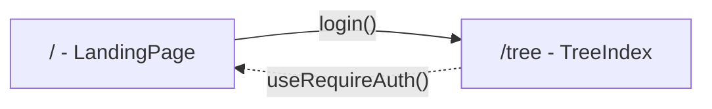
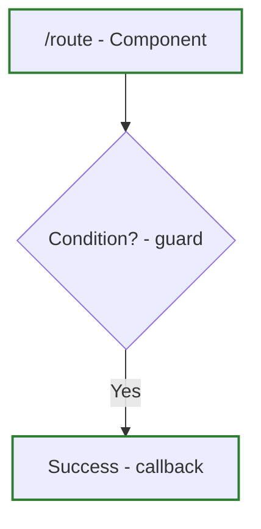
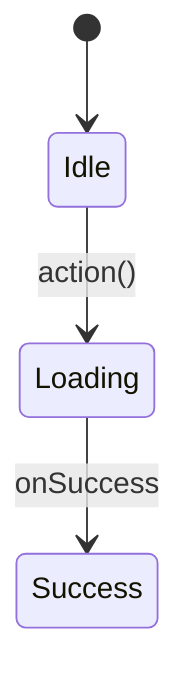

# Architect Skill

## Purpose
Plan and design full-stack architecture including:
- UI/UX flows with Mermaid diagrams
- Bill of Materials (existing code, new files, dependencies)
- Interface design (GraphQL, services, components)

## Modes

### Standalone Mode
Invoked directly: `/architect "feature description"`

### Feature Mode
Called by `/feature` skill during Phase 3 (Interfaces)

## Documentation Structure

### Locations
| Type | Location |
|------|----------|
| **Skill templates** | `.claude/skills/architect/templates/` |
| **Feature docs** | `docs/features/{feature}/` |

### Feature Folder Structure (5 files)
- `description.md` - Overview, source locations, BOM
- `todos.md` - Implementation TODO checklist
- `test-plan.md` - Test strategy and cases
- `journey.md` - User journeys with Mermaid diagrams
- `scratchpad.md` - Notes, ideas, issues

## Diagram Types

### Navigation (graph)
Route structure with auth guards:


### Journey (flowchart)
User flows with decision points and test markers:


### State (stateDiagram)
Component state machines:


## Code Mapping Requirements

Every diagram must include a **Code Reference Table** with clickable file links:

| Node | Route/Path | Component | File                                                                                             |
|------|------------|-----------|--------------------------------------------------------------------------------------------------|
| A    | /quests    | QuestList | [quest-list.component.ts](../../../src/app/quests/components/quest-list/quest-list.component.ts) |

### Node Label Format
- Routes: `["/route - ComponentName"]`
- Actions: `["Action - serviceFuntion()"]`
- Decisions: `{"Condition? - guardFunction"}`

## Test ID Convention

| Format                  | Usage                            |
|-------------------------|----------------------------------|
| `T-{FEATURE}-{NUMBER}`  | Standard test (e.g., T-TREE-001) |
| `T-{FEATURE}-S{NUMBER}` | State test (e.g., T-TREE-S01)    |
| `T-{FEATURE}-E{NUMBER}` | Edge case (e.g., T-TREE-E01)     |

## Workflow: Planning UI Changes

1. **Read affected journeys**: Find `docs/features/{feature}/journey.md` diagrams
2. **Identify impacts**: List all Code Reference Table entries affected
3. **Plan changes**: Determine what diagram updates are needed
4. **Verify references**: Check that file paths still exist
5. **Update diagrams**: Modify nodes, edges, and Code Reference Tables
6. **Update test markers**: Add/modify test IDs for new paths

## Workflow: Creating New Feature Docs

1. **Create feature folder**: `docs/features/{feature}/` with 5 files
2. **Fill journey.md**: Use Mermaid flowcharts and state diagrams
3. **Add Code Reference Table**: Include clickable relative file links
4. **Add Test Markers**: Define test IDs for key nodes
5. **Link related journeys**: Add "Related Journeys" section

---

## UI Consistency Checklist (MANDATORY)

Before finalizing component designs, check against quality standards:

### Component Reuse
- [ ] Search `src/app/shared` for existing components
- [ ] List which existing components will be used
- [ ] New reusable components go in shared, not feature-specific

### Styling
- [ ] Use SCSS files for all component styles
- [ ] NO hardcoded colors - use CSS variables
- [ ] NO inline styles


See `.claude/skills/QUALITY-STANDARDS.md` for full checklist.

---

## Bill of Materials (BOM)

Generate a BOM when planning features. Scan codebase to identify:

### Existing Code Inventory

```bash
# Find reusable components
grep -r "export const" src/app/shared/components/

# Find shared pipes
grep -r "export const use" src/app/shared/pipes/

```

### BOM Template

| Category  | Item          | Location                                             | Reuse/Create |
|-----------|---------------|------------------------------------------------------|--------------|
| Directive | Focus on init | src/app/shared/directives/focus-on-init.directive.ts | Reuse        |
| Component | Container     | src/app/shared/components/container                  | Reuse        |
| Module    | Stuff         | src/app/stuff/stuff.module.ts                        | Create       |
| Model     | Item          | src/app/stuff/models/item.ts                         | Create       |

### Output Location
Add BOM to `docs/features/{feature}/description.md` under "## Key Components"

---

## Interface Design

Design interfaces for all stack layers before implementation.

---

## Data & Schema Modeling (MANDATORY - VERIFY FIRST)

**Before ANY UI/UX or interface design, verify data model from BOM phase.**

---

## UI/UX Research Phase (MANDATORY - AFTER DATA MODEL VERIFIED)

**This phase MUST happen before ANY backend or interface design.**

### Step 0: Check Related Features (Domain Awareness)

**Before checking patterns, verify related features from BOM phase.**

1. **Read description.md** for "Related Features" section
2. **For each confirmed related feature**, read its `journey.md`:
   - Note shared navigation patterns
   - Note shared component usage
   - Note data model compatibility
3. **Ask about UI consistency** (if related features exist):

```
AskUserQuestion:
  question: "Should {feature-name} follow the same UI patterns as related features?"
  header: "UI Consistency"
  options:
    - label: "Yes, match existing (Recommended)"
      description: "Use same layouts, components, navigation as {related-feature}"
    - label: "No, different use case"
      description: "Design independently, different UX requirements"
    - label: "Partial match"
      description: "Reuse some patterns, customize others"
```

4. **Document cross-references discovered**:
   - If related feature should link to this one → note in scratchpad
   - If this feature needs to link to related → include in navigation design

### Step 1: Check Existing Patterns

Search for similar UI/UX patterns in the codebase:

```bash
# Find similar features/routes
grep -r "similar-keyword" src/app/

# Check existing components
ls src/app/shared/components/
```

### Step 2: Reference UX-DESIGN-GUIDE.md

**ALWAYS read** `.claude/skills/UX-DESIGN-GUIDE.md` before designing UI.

Key patterns to check:
- Loading states (when to show spinner vs skeleton)
- Empty states (icon + message + CTA pattern)
- Error states (retry option pattern)
- Form UX (validation timing, error display, button placement)
- Data tables (sorting, pagination, action columns)

### Step 3: Plan Component Splitting (CRITICAL)

**Rules for component architecture:**
- **One component per file** - Never multiple exports of components
- **Max ~150 lines per component** - Split if larger
- **Extract reusable pieces** - Tables, forms, modals → separate files

### Step 4: Create Wireframes (Mermaid/Markdown)

Create text-based wireframes showing:

```markdown
## Wireframe: Tree Editor Page

┌─────────────────────────────────────────────┐
│ Breadcrumbs: Home > Trees > {TreeName}      │
├─────────────────────────────────────────────┤
│ PageHeader: "Edit Tree"        [Save] [Back]│
├─────────────────────────────────────────────┤
│ ┌─────────────┬───────────────────────────┐ │
│ │ Tree Panel  │ Node Editor Panel         │ │
│ │ - Node 1    │ ┌───────────────────────┐ │ │
│ │   - Child   │ │ JSONForms Editor      │ │ │
│ │ - Node 2    │ │                       │ │ │
│ │             │ └───────────────────────┘ │ │
│ └─────────────┴───────────────────────────┘ │
└─────────────────────────────────────────────┘

**Components Used:**
- Breadcrumbs
- ResizablePanels
- JSONForms

**States:**
- Loading: Skeleton panels
- Empty: "Select a node" message
- Error: Error message + Retry button
```

### Step 5: Avoid Scope Creep (CRITICAL)

**DO NOT add unrequested features such as:**
- Dashboard cards/widgets
- Statistics/analytics
- Overview summaries
- "Nice to have" fields

**Before adding ANY UI element, ask:**
1. Did the user explicitly request this?
2. Is this in the requirements?
3. Does this add essential functionality?

If the answer is NO to any → **DO NOT ADD IT**

### Step 6: Review Checkpoint

Present wireframes to user BEFORE proceeding to interface design:

```markdown
## UI/UX Review

### Proposed Wireframes
{wireframe diagrams}

### Existing Patterns Reused
- Dashboard component for route start
- Top bar for filtering

### Field Visibility (Confirmed)
| Field | List View | Detail View |
|-------|-----------|-------------|

### Loading Behavior
| Relation | Strategy | Trigger |
|----------|----------|---------|

### URL Architecture
| Param | Purpose |
|-------|---------|

### Component Split
| Component | Location | Lines |
|-----------|----------|-------|

---
Does this UI approach look correct? Ready to design interfaces?
```

**DO NOT proceed to interface design until user approves wireframes.**

---

## Decision Process (SEQUENTIAL - Use AskUserQuestion)

**Make decisions ONE AT A TIME using `AskUserQuestion` tool.**

### Step 1: Architecture Pattern

First decision - the main approach:

```
AskUserQuestion:
  question: "What architecture pattern for {feature}?"
  header: "Architecture"
  options:
    - label: "Option A: {name}"
      description: "{one-line description} - Effort: Low, Risk: Low"
    - label: "Option B: {name}"
      description: "{one-line description} - Effort: Medium, Risk: Low"
```

**WAIT for user response before continuing.**

### Step 2: Data Model (if applicable)

```
AskUserQuestion:
  question: "How should we model the data?"
  header: "Data Model"
  options:
    - label: "Extend existing"
      description: "Add fields to existing Tree/Node model"
    - label: "New entity"
      description: "Create separate model with relations"
```

**WAIT for user response.**

### Step 3: State Management (if frontend)

```
AskUserQuestion:
  question: "Where should state live?"
  header: "State"
  options:
    - label: "Server state (Recommended)"
      description: "React Query, refetch on change"
    - label: "URL state"
      description: "Search params, shareable links"
    - label: "Client state"
      description: "Context/store, local persistence"
```

**WAIT for user response.**

### After All Decisions Made

THEN design the full architecture with chosen options.

### Decision Logging (MANDATORY)

Log each decision in `scratchpad.md` **temporarily**:

```markdown
## Active Decisions

### {Decision Topic}
**Question**: {What was asked}
**Options**: {List options}
**Chosen**: {User's choice}
**Rationale**: {Why}
```

**After phase completes:** Move finalized decisions to `description.md` under "## Architecture Decisions" and DELETE from scratchpad.

---

## Common Decision Dimensions

Consider these when generating options:

| Dimension      | Option A      | Option B            |
|----------------|---------------|---------------------|
| **Complexity** | Simple/direct | Flexible/extensible |
| **Reuse**      | Build new     | Extend existing     |
| **Data model** | Normalized    | Denormalized        |
| **State**      | Server-side   | Client-side         |

### Examples of Good Options

**Feature: Tree node editing**
- Option A: Inline edit (simple, quick to implement)
- Option B: Modal editor (more space, better for complex forms)

**Feature: Data export**
- Option A: Client-side generation (simple, works offline)
- Option B: Server-side generation (handles large data, better formatting)

**DO NOT proceed to detailed design until user chooses ALL options.**
