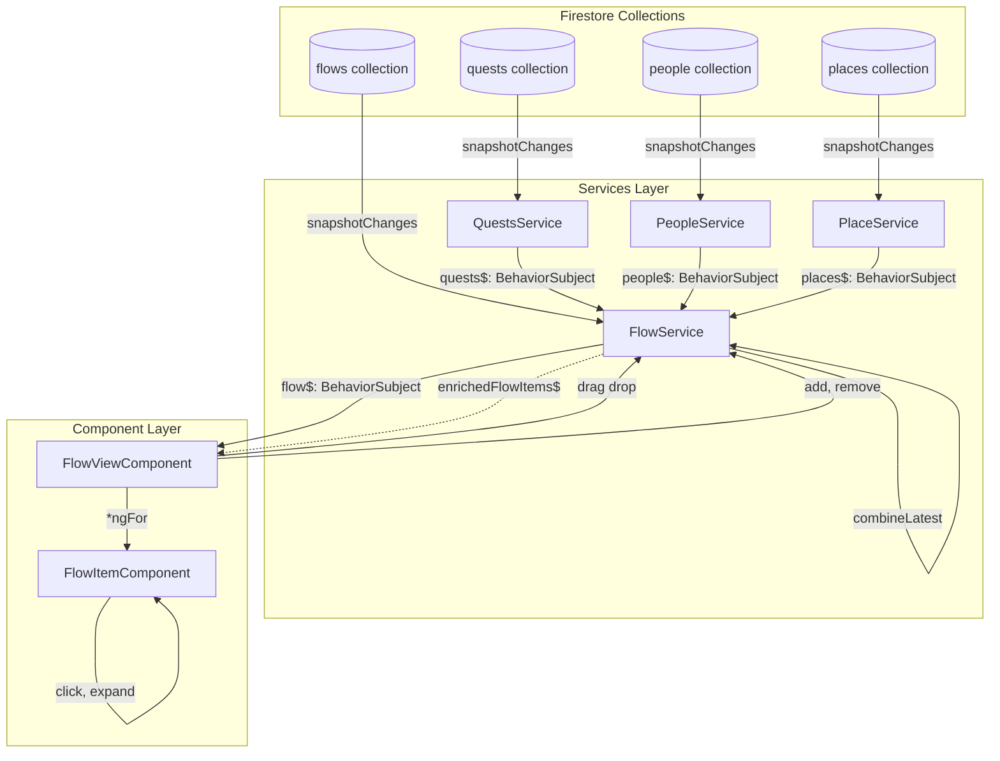
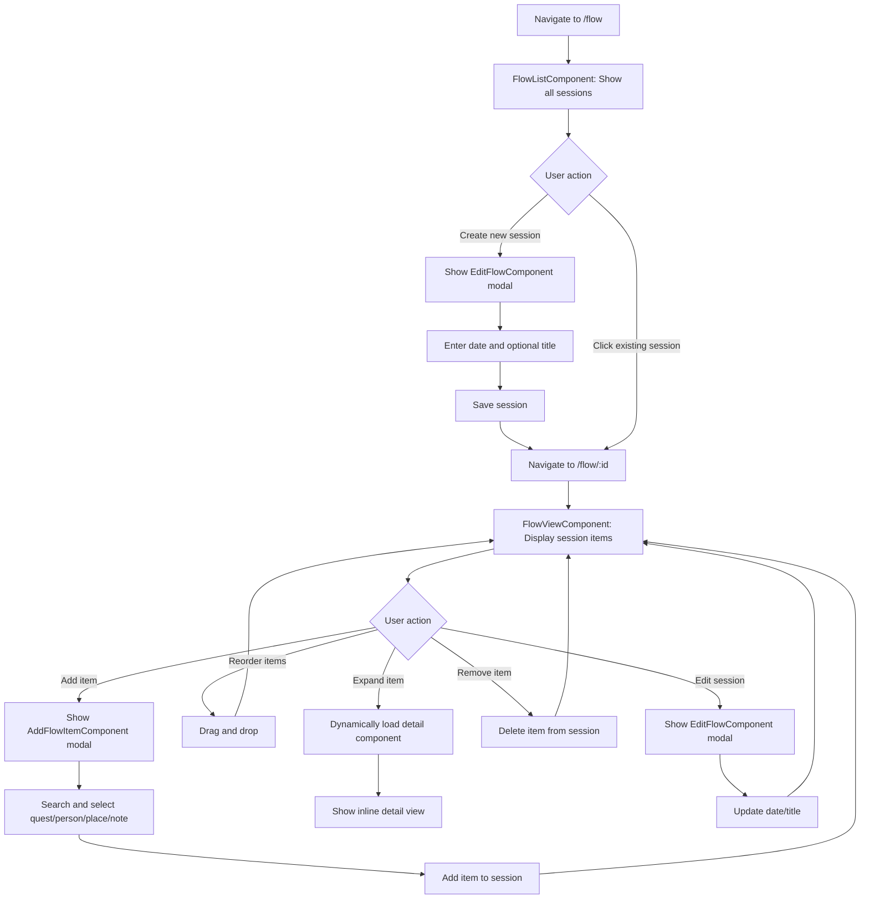
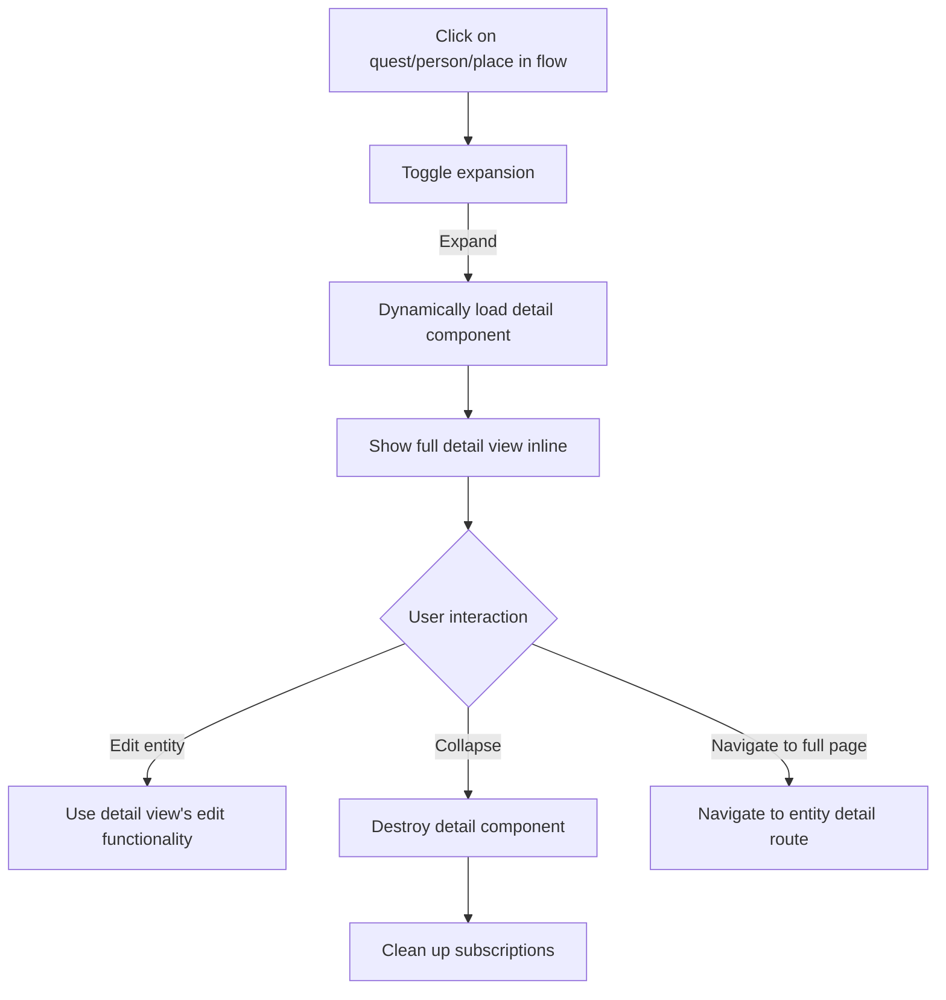
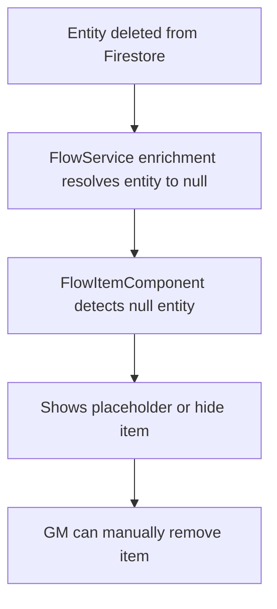

# Flow Feature - User Journeys

## Entry Points
- Route: `/flow` (session list)
- Route: `/flow/:id` (specific session)
- Navigation: "Sessions" menu item in main navigation

## Code Reference Table

| ID            | Component/Service      | File                                                                                                                                              |
|---------------|------------------------|---------------------------------------------------------------------------------------------------------------------------------------------------|
| FlowList      | FlowListComponent      | [src/app/flow/components/flow-list/flow-list.component.ts](../../../src/app/flow/components/flow-list/flow-list.component.ts)                     |
| FlowView      | FlowViewComponent      | [src/app/flow/components/flow-view/flow-view.component.ts](../../../src/app/flow/components/flow-view/flow-view.component.ts)                     |
| EditFlow      | EditFlowComponent      | [src/app/flow/components/edit-flow/edit-flow.component.ts](../../../src/app/flow/components/edit-flow/edit-flow.component.ts)                     |
| FlowService   | FlowService            | [src/app/flow/services/flow.service.ts](../../../src/app/flow/services/flow.service.ts)                                                           |
| FlowItem      | FlowItemComponent      | [src/app/flow/components/flow-item/flow-item.component.ts](../../../src/app/flow/components/flow-item/flow-item.component.ts)                     |
| AddItem       | AddFlowItemComponent   | [src/app/flow/components/add-flow-item/add-flow-item.component.ts](../../../src/app/flow/components/add-flow-item/add-flow-item.component.ts)     |

## Architecture: Data Flow



**Data Resolution Pattern:**
```typescript
// FlowService pseudo-code
enrichedFlowItems$ = combineLatest([
  flow$,           // Flow document with items array
  quests$,         // All quests
  people$,         // All people
  places$          // All places
]).pipe(
  map(([flow, quests, people, places]) => {
    return flow.items.map(item => {
      if (item.type === 'quest') {
        const quest = quests.find(q => q.id === item.questId);
        return { ...item, entity: quest };
      }
      // Similar for person, place
      return item;
    });
  })
);
```

## Primary Flow: Session Management



## Secondary Flow: Entity Interaction



## Flow: Auto-Remove on Entity Delete



## States

### Session List (FlowListComponent)
- **Empty State**: "No sessions yet" with "Create Session" button
- **Loading State**: Skeleton loaders
- **List State**: Cards showing date, title, item count
- **Filtered State**: Search results

### Session View (FlowViewComponent)
- **Empty State**: "No items in this session" with "Add Item" button
- **Loading State**: Skeleton loader for items
- **Items State**: List of flow items in order, each showing:
  - Quest: Quest name, icon, status
  - Person: Person name, avatar
  - Place: Place name, icon
  - Note: Note title, preview
- **Collapsed Item**: Compact view with drag handle
- **Expanded Item**: Inline detail component loaded dynamically
- **Error State**: Message if flow fails to load

---

## Interface Designs

### FlowService Interface

```typescript
@Injectable({
  providedIn: 'root'
})
export class FlowService {
  static readonly collection = 'flows';
  private flows$: BehaviorSubject<Flow[]>;

  constructor(
    private api: ApiService,
    private auth: AuthService,
    private data: DataService,
    private quests: QuestsService,
    private people: PeopleService,
    private places: PlaceService,
    private notes: NotesService
  ) {}

  // Get all flows for current user
  getFlows(): Observable<Flow[]>;

  // Get single flow by ID
  getFlowById(id: string): Observable<Flow | null>;

  // Get flow items enriched with entity data
  getEnrichedFlowItems(flowId: string): Observable<EnrichedFlowItem[]>;

  // Create or update flow
  storeFlow(flow: Partial<Flow>, id?: string): Promise<{ success: boolean; id?: string }>;

  // Add item to flow
  addItem(flowId: string, item: Partial<FlowItem>): Promise<boolean>;

  // Remove item from flow
  removeItem(flowId: string, itemId: string): Promise<boolean>;

  // Reorder items (after drag and drop)
  reorderItems(flowId: string, items: FlowItem[]): Promise<boolean>;

  // Delete flow
  deleteFlow(flowId: string): Promise<boolean>;
}
```

### Component Interfaces

#### FlowListComponent

```typescript
@Component({
  selector: 'app-flow-list',
  templateUrl: './flow-list.component.html',
  styleUrls: ['./flow-list.component.scss']
})
export class FlowListComponent implements OnInit {
  flows$: Observable<Flow[]>;
  filteredFlows$: Observable<Flow[]>;
  filterText: BehaviorSubject<string>;

  constructor(
    private flowService: FlowService,
    private popover: PopoverService,
    private navigation: NavigationService,
    private router: Router
  ) {}

  ngOnInit(): void;
  onFilterChanged(text: string): void;
  showCreateFlowDialog(): void;
  getFormattedDate(date: Date): string;
}
```

#### FlowViewComponent

```typescript
@Component({
  selector: 'app-flow-view',
  templateUrl: './flow-view.component.html',
  styleUrls: ['./flow-view.component.scss']
})
export class FlowViewComponent implements OnInit {
  flow$: Observable<Flow | null>;
  enrichedFlowItems$: Observable<EnrichedFlowItem[]>;
  flowId: string;

  constructor(
    private route: ActivatedRoute,
    private flowService: FlowService,
    private popover: PopoverService,
    private navigation: NavigationService
  ) {}

  ngOnInit(): void;
  onDrop(event: CdkDragDrop<EnrichedFlowItem[]>): void;
  showAddItemModal(): void;
  showEditFlowModal(): void;
  removeItem(itemId: string): void;
  deleteFlow(): void;
}
```

#### EditFlowComponent

```typescript
@Component({
  selector: 'app-edit-flow',
  templateUrl: './edit-flow.component.html',
  styleUrls: ['./edit-flow.component.scss']
})
export class EditFlowComponent implements OnInit, PopoverChild {
  @Input() props: EditFlowProps;
  @Output() dismissPopover = new EventEmitter<boolean>();

  flowForm: UntypedFormGroup;

  constructor(
    private auth: AuthService,
    private flowService: FlowService
  ) {}

  ngOnInit(): void;
  save(): void;
  formatDateForInput(date: Date): string;
}
```

#### FlowItemComponent

```typescript
@Component({
  selector: 'app-flow-item',
  templateUrl: './flow-item.component.html',
  styleUrls: ['./flow-item.component.scss']
})
export class FlowItemComponent {
  @Input() item: EnrichedFlowItem;
  @Output() remove = new EventEmitter<string>();

  expanded = false;
  menu: Menu;

  constructor(
    private navigation: NavigationService,
    private data: DataService
  ) {}

  toggleExpand(): void;
  navigateToEntity(): void;
  openContextMenu(): void;
}
```

#### AddFlowItemComponent

```typescript
@Component({
  selector: 'app-add-flow-item',
  templateUrl: './add-flow-item.component.html',
  styleUrls: ['./add-flow-item.component.scss']
})
export class AddFlowItemComponent implements OnInit, PopoverChild {
  @Input() props: { flowId: string };
  @Output() dismissPopover = new EventEmitter<boolean>();

  activeTab: 'quest' | 'person' | 'place' | 'note' = 'quest';
  searchText = '';

  quests$: Observable<Quest[]>;
  people$: Observable<Person[]>;
  places$: Observable<Place[]>;
  notes$: Observable<Note[]>;

  filteredQuests$: Observable<Quest[]>;
  filteredPeople$: Observable<Person[]>;
  filteredPlaces$: Observable<Place[]>;
  filteredNotes$: Observable<Note[]>;

  selectedItems: string[] = [];

  constructor(
    private flowService: FlowService,
    private questsService: QuestsService,
    private peopleService: PeopleService,
    private placesService: PlaceService,
    private notesService: NotesService,
    private popover: PopoverService
  ) {}

  ngOnInit(): void;
  switchTab(tab: string): void;
  onSearchChange(text: string): void;
  toggleSelection(id: string): void;
  addSelected(): void;
  close(): void;
}
```

### Data Models

#### FlowDB (Firestore Schema)

```typescript
import type { Timestamp } from '@angular/fire/firestore';

export interface FlowDB {
  date: Timestamp; // Session date
  title?: string; // Optional session title
  owner: string;
  access: string[];
  items: FlowItemDB[];
}

export type FlowItemDB =
  | QuestFlowItemDB
  | PersonFlowItemDB
  | PlaceFlowItemDB
  | NoteFlowItemDB;

interface BaseFlowItemDB {
  id: string;
  order: number;
}

export interface QuestFlowItemDB extends BaseFlowItemDB {
  type: 'quest';
  questId: string;
}

export interface PersonFlowItemDB extends BaseFlowItemDB {
  type: 'person';
  personId: string;
}

export interface PlaceFlowItemDB extends BaseFlowItemDB {
  type: 'place';
  placeId: string;
}

export interface NoteFlowItemDB extends BaseFlowItemDB {
  type: 'note';
  noteId: string;
}
```

#### Flow (Application Model)

```typescript
import type { AccessControlledItem } from '../../core/models/access-controlled-item';

export interface Flow extends AccessControlledItem {
  date: Date; // Session date
  title?: string; // Optional session title
  items: FlowItem[];
}

export type FlowItem =
  | QuestFlowItem
  | PersonFlowItem
  | PlaceFlowItem
  | NoteFlowItem;

interface BaseFlowItem {
  id: string;
  order: number;
}

export interface QuestFlowItem extends BaseFlowItem {
  type: 'quest';
  questId: string;
}

export interface PersonFlowItem extends BaseFlowItem {
  type: 'person';
  personId: string;
}

export interface PlaceFlowItem extends BaseFlowItem {
  type: 'place';
  placeId: string;
}

export interface NoteFlowItem extends BaseFlowItem {
  type: 'note';
  noteId: string;
}

// Enriched types (with resolved entity data)
export type EnrichedFlowItem =
  | EnrichedQuestFlowItem
  | EnrichedPersonFlowItem
  | EnrichedPlaceFlowItem
  | EnrichedNoteFlowItem;

export interface EnrichedQuestFlowItem extends QuestFlowItem {
  entity: Quest | null; // null if quest deleted
}

export interface EnrichedPersonFlowItem extends PersonFlowItem {
  entity: Person | null;
}

export interface EnrichedPlaceFlowItem extends PlaceFlowItem {
  entity: Place | null;
}

export interface EnrichedNoteFlowItem extends NoteFlowItem {
  entity: Note | null;
}
```

#### FlowItemType (no enum, using string literals)

Flow items use TypeScript discriminated unions with string literal types:
- `'quest'`
- `'person'`
- `'place'`
- `'note'`
