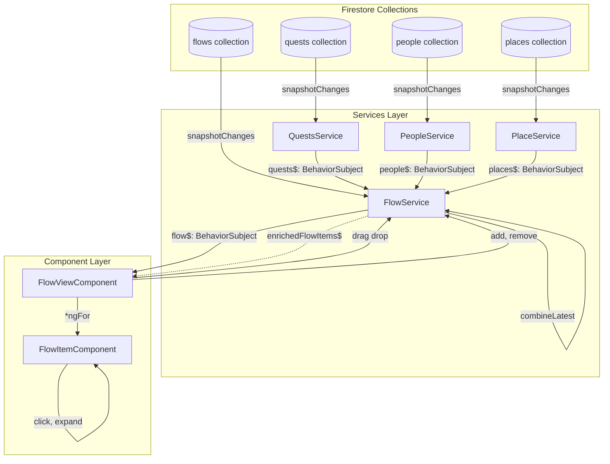
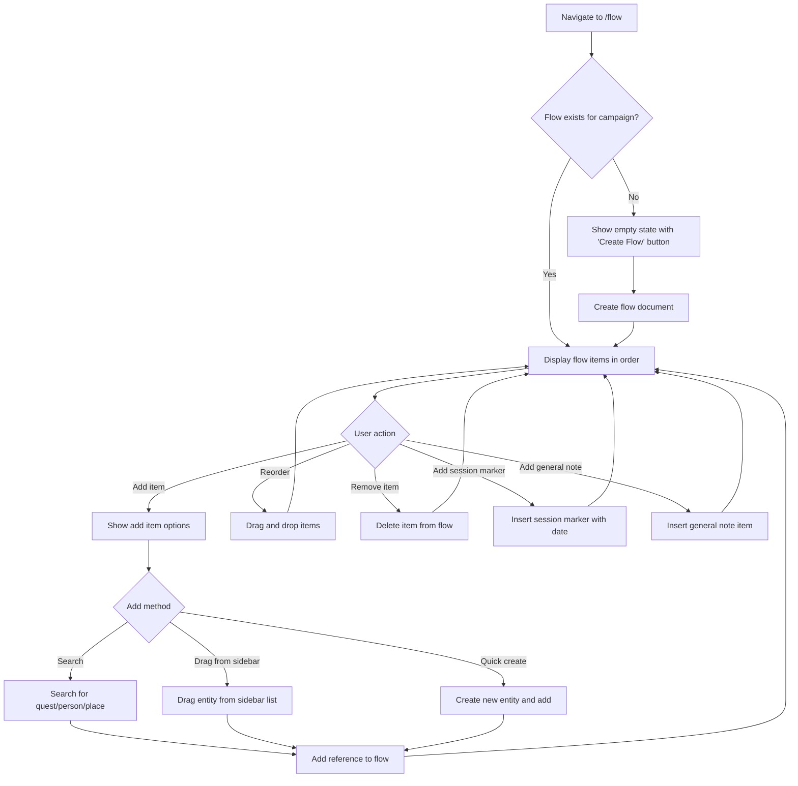
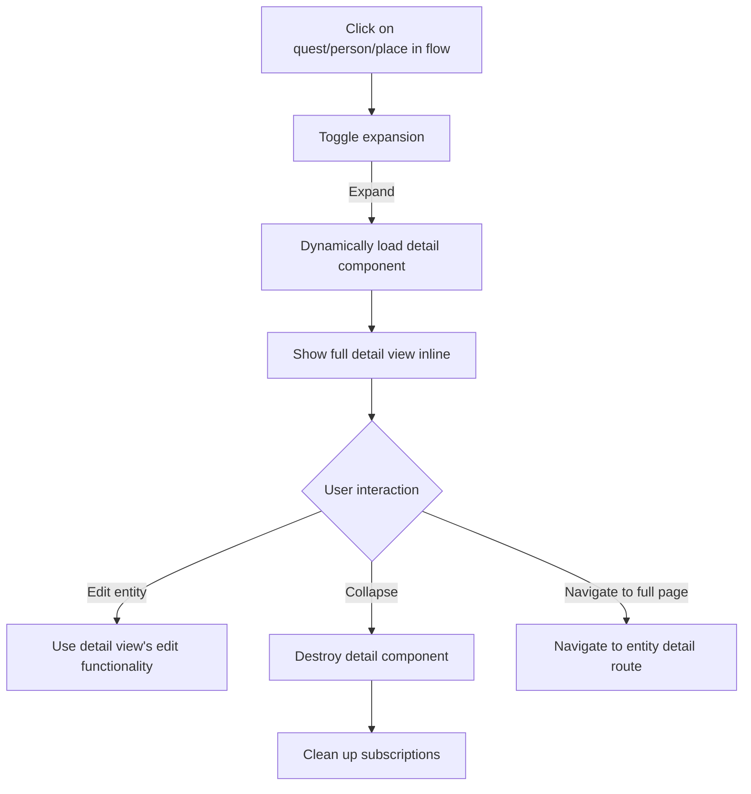
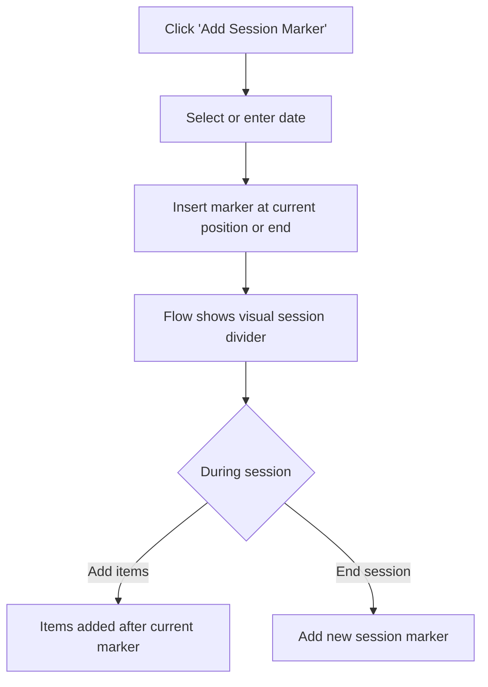
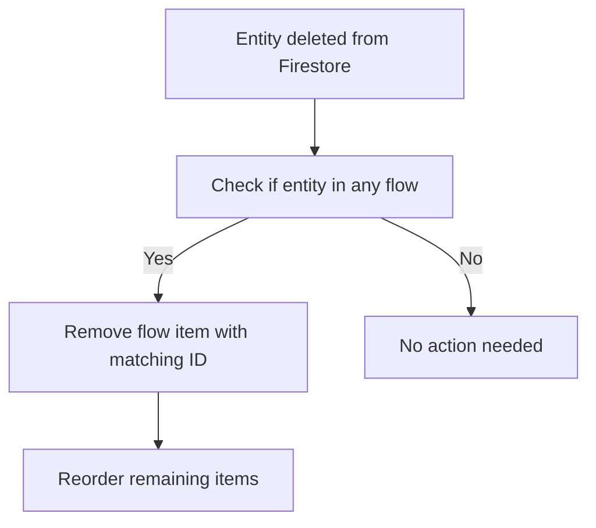

# Flow Feature - User Journeys

## Entry Points
- Route: `/flow` (dedicated page)
- Navigation: "Session Flow" menu item in main navigation

## Code Reference Table

| ID            | Component/Service      | File                                                                                                                                              |
|---------------|------------------------|---------------------------------------------------------------------------------------------------------------------------------------------------|
| FlowView      | FlowViewComponent      | [src/app/flow/components/flow-view/flow-view.component.ts](../../../src/app/flow/components/flow-view/flow-view.component.ts)                     |
| FlowService   | FlowService            | [src/app/flow/services/flow.service.ts](../../../src/app/flow/services/flow.service.ts)                                                           |
| FlowItem      | FlowItemComponent      | [src/app/flow/components/flow-item/flow-item.component.ts](../../../src/app/flow/components/flow-item/flow-item.component.ts)                     |
| AddItem       | AddFlowItemComponent   | [src/app/flow/components/add-flow-item/add-flow-item.component.ts](../../../src/app/flow/components/add-flow-item/add-flow-item.component.ts)     |
| SessionMarker | SessionMarkerComponent | [src/app/flow/components/session-marker/session-marker.component.ts](../../../src/app/flow/components/session-marker/session-marker.component.ts) |
| GeneralNote   | GeneralNoteComponent   | [src/app/flow/components/general-note/general-note.component.ts](../../../src/app/flow/components/general-note/general-note.component.ts)         |

## Architecture: Data Flow



**Data Resolution Pattern:**
```typescript
// FlowService pseudo-code
enrichedFlowItems$ = combineLatest([
  flow$,           // Flow document with items array
  quests$,         // All quests
  people$,         // All people
  places$          // All places
]).pipe(
  map(([flow, quests, people, places]) => {
    return flow.items.map(item => {
      if (item.type === 'quest') {
        const quest = quests.find(q => q.id === item.questId);
        return { ...item, entity: quest };
      }
      // Similar for person, place
      return item;
    });
  })
);
```

## Primary Flow: View and Edit Session Flow



## Secondary Flow: Entity Interaction



## Flow: Session Marker Management



## Flow: Auto-Remove on Entity Delete



## States

### Empty State
- Message: "You haven't created a session flow yet"
- Action: "Create Flow" button

### Loading State
- Skeleton loader for flow items

### Flow with Items
- List of flow items in order
- Each item shows:
  - Quest: Quest name, icon
  - Person: Person name, avatar
  - Place: Place name, icon
  - Session marker: Date, visual divider
  - General note: Note content (editable inline)

### Error State
- Message if flow fails to load
- Retry button

---

## Interface Designs

### FlowService Interface

```typescript
@Injectable({
  providedIn: 'root'
})
export class FlowService {
  static readonly collection = 'flows';
  private flow$: BehaviorSubject<Flow | null>;
  private enrichedFlowItems$: Observable<EnrichedFlowItem[]>;

  constructor(
    private api: ApiService,
    private auth: AuthService,
    private data: DataService,
    private quests: QuestsService,
    private people: PeopleService,
    private places: PlaceService,
    private config: ConfigService
  ) {}

  // Get flow for current campaign (single campaign app)
  getFlow(): Observable<Flow | null>;

  // Get flow items enriched with entity data
  getEnrichedFlowItems(): Observable<EnrichedFlowItem[]>;

  // Add item to flow
  addItem(item: Partial<FlowItem>): Promise<boolean>;

  // Remove item from flow
  removeItem(itemId: string): Promise<boolean>;

  // Reorder items (after drag and drop)
  reorderItems(items: FlowItem[]): Promise<boolean>;

  // Update session marker date
  updateSessionMarker(itemId: string, date: Timestamp): Promise<boolean>;

  // Update general note content
  updateGeneralNote(itemId: string, content: string): Promise<boolean>;

  // Create flow if it doesn't exist
  createFlow(campaignId: string): Promise<boolean>;
}
```

### Component Interfaces

#### FlowViewComponent

```typescript
@Component({
  selector: 'app-flow-view',
  templateUrl: './flow-view.component.html',
  styleUrls: ['./flow-view.component.scss']
})
export class FlowViewComponent implements OnInit {
  enrichedFlowItems$: Observable<EnrichedFlowItem[]>;
  loading = true;
  error: string | null = null;

  constructor(
    private flowService: FlowService,
    private popover: PopoverService,
    private navigation: NavigationService
  ) {}

  ngOnInit(): void;
  onDrop(event: CdkDragDrop<EnrichedFlowItem[]>): void;
  showAddItemModal(): void;
  addSessionMarker(): void;
  addGeneralNote(): void;
  removeItem(itemId: string): void;
}
```

#### FlowItemComponent

```typescript
@Component({
  selector: 'app-flow-item',
  templateUrl: './flow-item.component.html',
  styleUrls: ['./flow-item.component.scss']
})
export class FlowItemComponent {
  @Input() item: EnrichedFlowItem;
  @Output() remove = new EventEmitter<string>();

  expanded = false;
  menu: Menu;

  constructor(
    private navigation: NavigationService,
    private data: DataService
  ) {}

  toggleExpand(): void;
  navigateToEntity(): void;
  openContextMenu(): void;
}
```

#### AddFlowItemComponent

```typescript
@Component({
  selector: 'app-add-flow-item',
  templateUrl: './add-flow-item.component.html',
  styleUrls: ['./add-flow-item.component.scss']
})
export class AddFlowItemComponent implements OnInit {
  activeTab: 'quest' | 'person' | 'place' | 'session' | 'note' = 'quest';
  searchText = '';

  quests$: Observable<Quest[]>;
  people$: Observable<Person[]>;
  places$: Observable<Place[]>;
  filteredQuests$: Observable<Quest[]>;
  filteredPeople$: Observable<Person[]>;
  filteredPlaces$: Observable<Place[]>;

  selectedItems: string[] = [];
  sessionDate: Date = new Date();
  noteContent = '';

  constructor(
    private flowService: FlowService,
    private questsService: QuestsService,
    private peopleService: PeopleService,
    private placesService: PlaceService,
    private popover: PopoverService
  ) {}

  ngOnInit(): void;
  switchTab(tab: string): void;
  onSearchChange(text: string): void;
  toggleSelection(id: string): void;
  addSelected(): void;
  addSessionMarker(): void;
  addGeneralNote(): void;
  close(): void;
}
```

### Data Models

#### FlowDB (Firestore Schema)

```typescript
import type { FieldValue, Timestamp } from '@angular/fire/firestore';

export interface FlowDB {
  campaignId: string;
  createdBy: string;
  createdAt: Timestamp;
  updatedAt: Timestamp;
  access: string[];
  items: FlowItemDB[];
}

export type FlowItemDB =
  | QuestFlowItemDB
  | PersonFlowItemDB
  | PlaceFlowItemDB
  | SessionMarkerFlowItemDB
  | GeneralNoteFlowItemDB;

interface BaseFlowItemDB {
  id: string;
  order: number;
}

export interface QuestFlowItemDB extends BaseFlowItemDB {
  type: 'quest';
  questId: string;
}

export interface PersonFlowItemDB extends BaseFlowItemDB {
  type: 'person';
  personId: string;
}

export interface PlaceFlowItemDB extends BaseFlowItemDB {
  type: 'place';
  placeId: string;
}

export interface SessionMarkerFlowItemDB extends BaseFlowItemDB {
  type: 'session-marker';
  date: Timestamp;
}

export interface GeneralNoteFlowItemDB extends BaseFlowItemDB {
  type: 'general-note';
  content: string;
}
```

#### Flow (Application Model)

```typescript
import type { Quest } from '../../quests/models/quest';
import type { Person } from '../../people/models/person';
import type { Place } from '../../places/models/place';

export interface Flow {
  id: string;
  campaignId: string;
  createdBy: string;
  createdAt: Date;
  updatedAt: Date;
  access: string[];
  items: FlowItem[];
  collection: 'flows';
}

export type FlowItem =
  | QuestFlowItem
  | PersonFlowItem
  | PlaceFlowItem
  | SessionMarkerFlowItem
  | GeneralNoteFlowItem;

interface BaseFlowItem {
  id: string;
  order: number;
}

export interface QuestFlowItem extends BaseFlowItem {
  type: 'quest';
  questId: string;
}

export interface PersonFlowItem extends BaseFlowItem {
  type: 'person';
  personId: string;
}

export interface PlaceFlowItem extends BaseFlowItem {
  type: 'place';
  placeId: string;
}

export interface SessionMarkerFlowItem extends BaseFlowItem {
  type: 'session-marker';
  date: Date;
}

export interface GeneralNoteFlowItem extends BaseFlowItem {
  type: 'general-note';
  content: string;
}

// Enriched types (with resolved entity data)
export type EnrichedFlowItem =
  | EnrichedQuestFlowItem
  | EnrichedPersonFlowItem
  | EnrichedPlaceFlowItem
  | SessionMarkerFlowItem
  | GeneralNoteFlowItem;

export interface EnrichedQuestFlowItem extends QuestFlowItem {
  entity: Quest | null; // null if quest deleted
}

export interface EnrichedPersonFlowItem extends PersonFlowItem {
  entity: Person | null;
}

export interface EnrichedPlaceFlowItem extends PlaceFlowItem {
  entity: Place | null;
}
```

#### FlowItemType Enum

```typescript
export enum FlowItemType {
  Quest = 'quest',
  Person = 'person',
  Place = 'place',
  SessionMarker = 'session-marker',
  GeneralNote = 'general-note'
}
```
