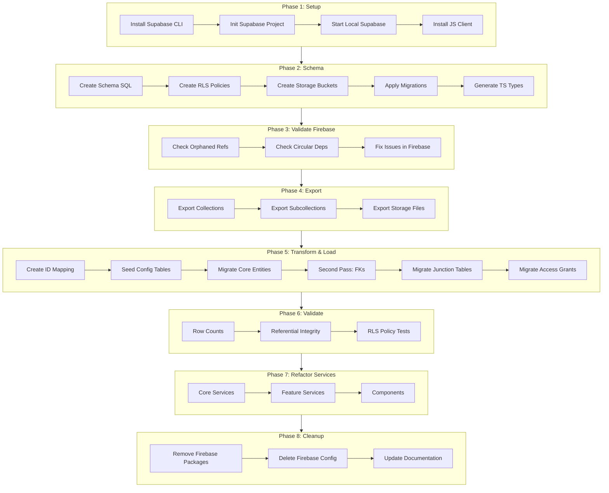
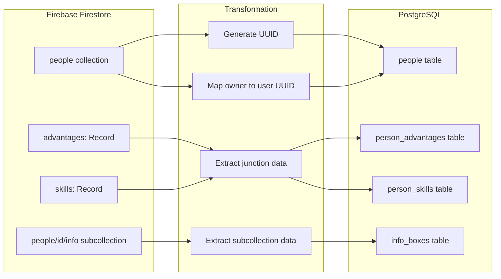
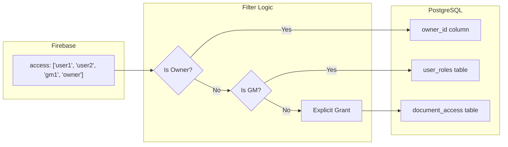
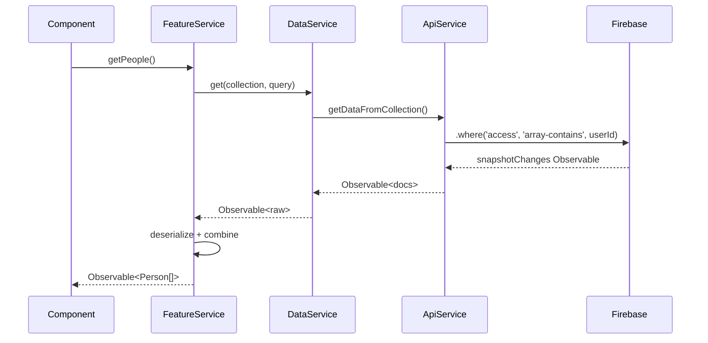
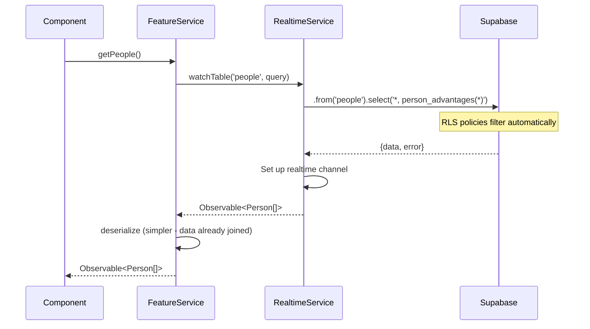
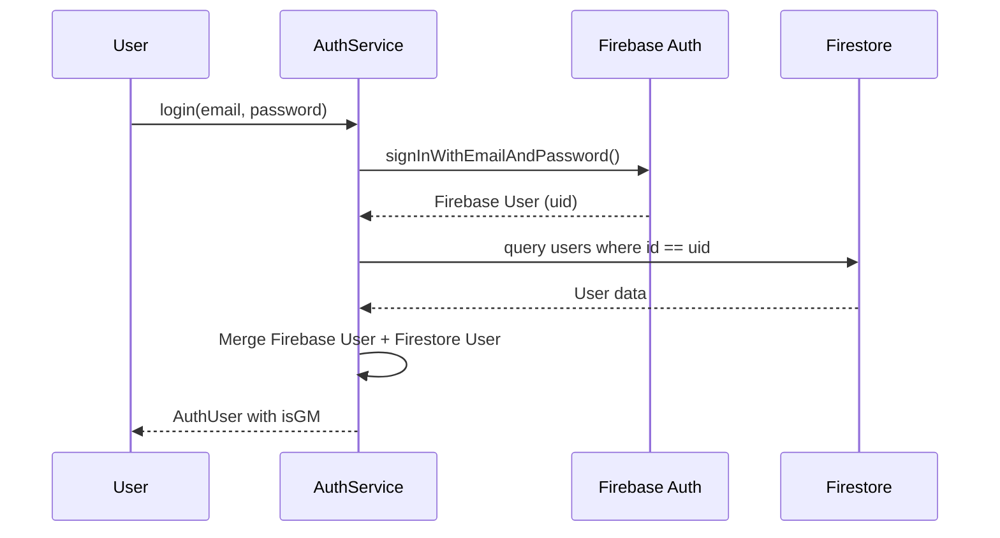
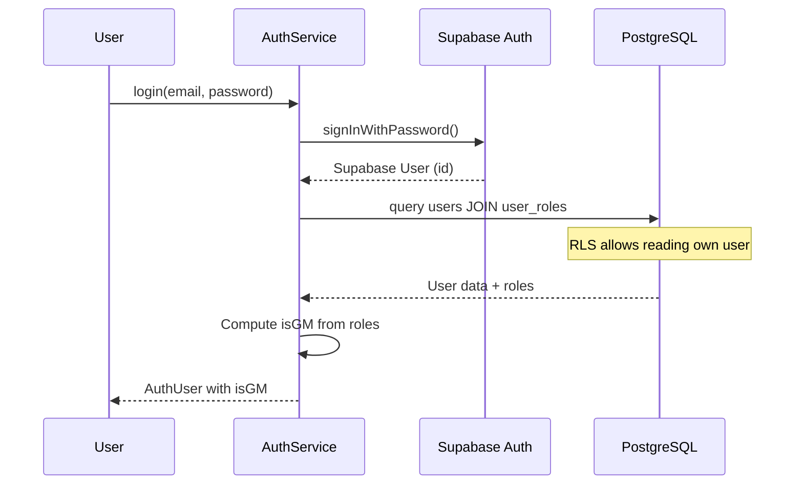
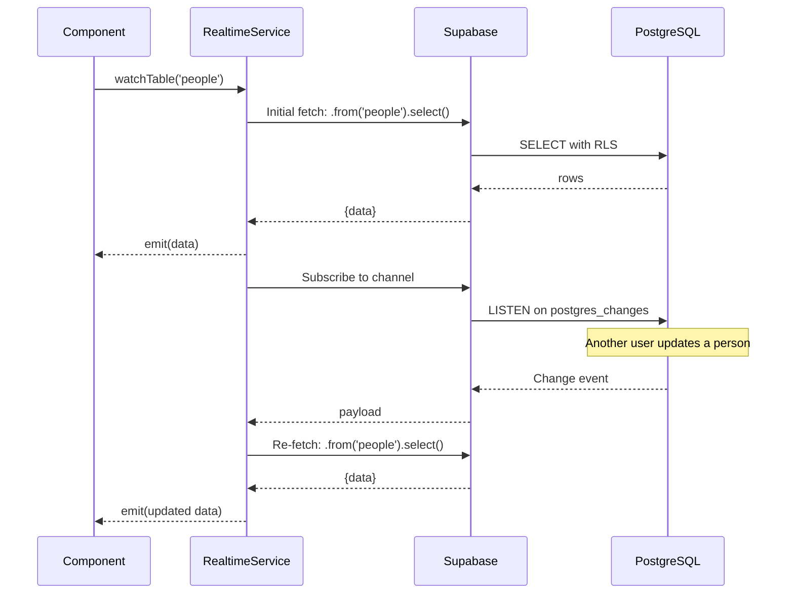
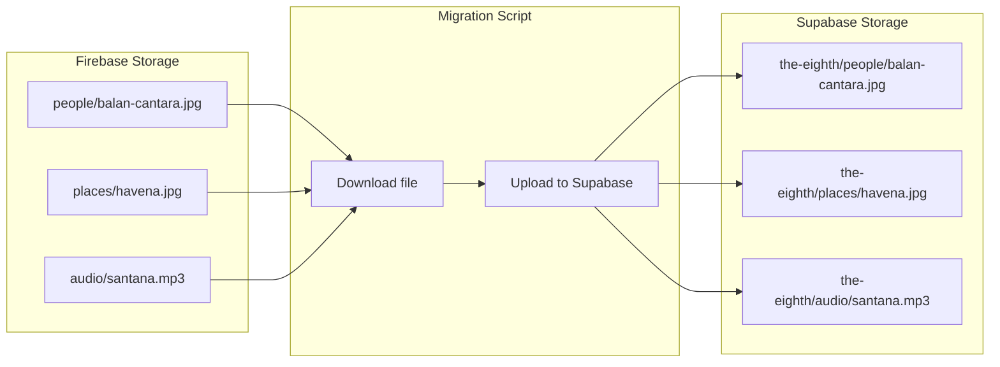

# Supabase Migration - Journeys

## Migration Process Flow

## Data Transformation Flow

### Person Entity Migration

### Access Control Migration

## Service Layer Flow

### Before (Firebase)

### After (Supabase)

## Authentication Flow

### Before (Firebase Auth)

### After (Supabase Auth)

## Real-time Subscription Flow

## Storage Migration Flow

## Entry Points

| Entry Point | Description |
|-------------|-------------|
| `npx supabase start` | Start local Supabase for development |
| `npm run migrate:validate` | Run pre-migration validation (to be created) |
| `npm run migrate:export` | Export Firebase data (to be created) |
| `npm run migrate:transform` | Transform and load data (to be created) |
| `npm run migrate:storage` | Migrate storage files (to be created) |
| `npm run migrate:verify` | Verify migration integrity (to be created) |
